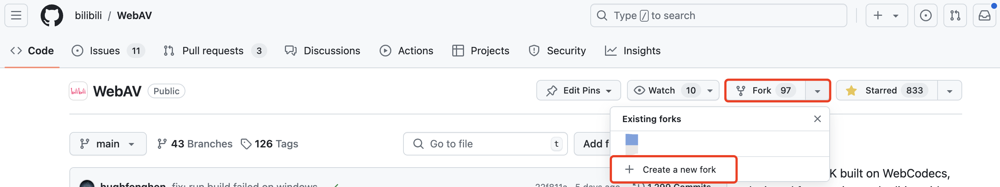

---
nav:
  title: 指南
  order: 2
group:
  title: 其他
  order: 4
order: 1
---

# 贡献指南

## 我可以贡献什么？

- features 新增/修改功能特性
- unitest 新增/修改单测
- bugfix 修复现有 issue 的问题
- doc 文档改进
- other 其他

## 如何贡献？

#### 拉取仓库

- 原始仓库：https://github.com/bilibili/WebAV.git
- 目标仓库：fork 到自己的 github 上
  

#### 拉取分支

原始分支是 bilibili/WebAV main，拉取后的分支应该是 `你的git帐户名`/WebAV main

#### 提交代码

非特殊说明，请切勿在代码中附带任何与 console 相关的方法及 debugger。开发完成后，在自己 fork 出来的仓库提交 pull request。

#### PR 规范

- 格式：`<type>(<scope>): <subject>` 举例：feat(doc): change video doc
- 内容：罗列本次改动的具体内容
- 要求：增加的 feat 内容，尽量做到注释清晰，相应的单测覆盖要尽可能覆盖
- BUGFIX 要求：如果修改的问题和 issues 相关，请在内容中附上相关的 issueID。

#### 审核与合并

#### 同步源仓库变更到 fork 后的仓库

```zsh
# 首先在自己的分支增加一个 upstream，即原仓库
$ git remote add upstream https://github.com/bilibili/WebAV.git
# 获取原仓库最新的变更
$ git fetch upstream
# 同步原仓库的改动到本地分支
$ git pull upstream master [当前本地目标分支，不填默认就是当前分支]
```

#### 项目开发

```zsh
# clone 当前项目到本地
$ git clone https://github.com/bilibili/WebAV.git
```

<br/>

```zsh
# 进入项目目录
$ npm install && pnpm build
```

<br/>

```zsh
# cd 到 `packages/xxx` 目录下
$ pnpm dev
```

在浏览器中打开 DEMO URL，如 http://localhost:6066/concat-media.html

```zsh
# 运行该package的单元测试
$ pnpm test
```
